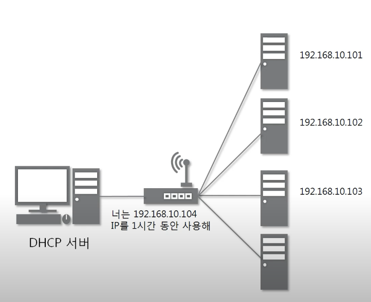
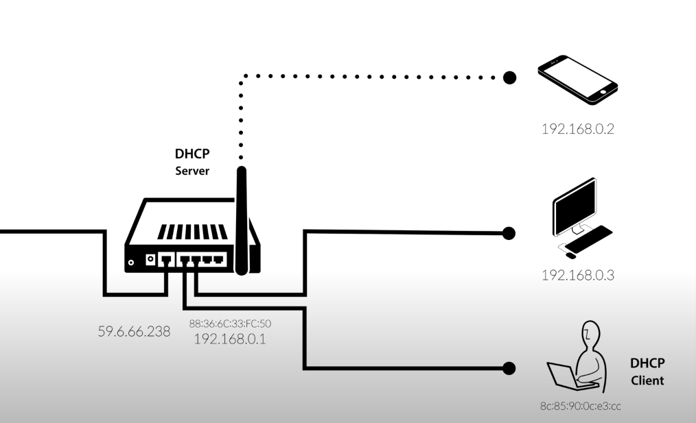

### 😀 DHCP(Dynamic Host Configuration Protocol)

 

#### 💬 DHCP 프로토콜의 정의

---

- 동적으로 네트워크에 연결된 장치에게 IP 주소를 자동으로 할당해주는 프로토콜
    - 또한 서브넷 마스크, 기본 게이트웨이, DNS 서버 주소 등의 네트워크 설정 정보도 함께 제공함
- ip 주소와 같은 식별자는 절대로 같은 범위 안에서는 중복되어서는 안되기에 DHCP는 IP 주소를 중복되지 않게 할당함
- OSI 7계층 중 4계층(전송 계층)에 위치함
    - DHCP 서버는 UDP를 기반으로함
- Wifi 접속 시 혹은 공유기에 연결된 선에 인터넷 연결 시, 자동으로 IP 주소를 할당함
- 공유기,라우터 혹은 와이파이 공유기에 DHCP 서버 설정이 내장되어 있음

- DHCP 서버
    - 같은 네트워크 대역에서 ip 주소를 중복되지 않게 할당해주는 서버
    - 할당된 시간(리스 시간)만큼 Ip주소를 사용할 수 있도록 ip 주소를 임대해줌

- DHCP Client
    - 인터넷을 사용하는 기기에는 자동으로 DHCP Client가 내장되어 있음
    - DHCP 서버에게 IP 주소를 요청함
    - 네트워크 통신 부품에는 고유한 식별자들이 있음
    - (예: MAC 주소,Physical 주소)

<table>
<tr>
  <td></td>
  <td></td>
</tr>
</table>

 

+) ip 주소를 수동으로 설정하는 방법

- (윈도우 기준) 설정에서 IP 주소, 서브넷 마스크, DNS를 수동으로 설정할 수 있음

 

#### 🏃🏻 DHCP 프로토콜의 작동과정

---

1. **DHCP Discover**: DHCP 클라이언트가 네트워크에 연결되면, DHCP 서버를 찾기 위해 브로드캐스트 패킷을 보냄

+)브로트 캐스트 패킷
- 특정 네트워크에 연결된 모든 장치에게 패킷을 전송하는 방식
- 네트워크 내 모든 장치가 해당 브로드 캐스트 패킷을 수신하지만, DHCP 서버만 해당 패킷에 응답함
 

2. **DHCP Offer**: DHCP 서버는 클라이언트에게 IP 주소를 할당할 수 있음을 알리는 패킷을 보냄

- DHCP 서버는 해당 요청을 수신하고 사용 가능한 IP 주소를 할당함
- DHCP 서버는 네트워크 내 할당된 IP주소를 기억하고 있으며, 그 다음 IP 주소를 할당함
- IP 주소를 할당할 때, 중복되는지 확인함

3. **DHCP Request**: DHCP 클라이언트는 받은 IP 주소를 사용하겠다는 응답을 DHCP 서버에게 보냄

4. **DHCP Ack**: DHCP 서버는 클라이언트에게 IP 주소를 확정적으로 할당하고, 이에 대한 확인 응답함

- 이때, IP 주소의 '리스' 시간도 함께 지정함

5. 해당 과정을 통해 DHCP 클라이언트는 자동적으로 IP 주소가 할당됨

 

6. IP 주소가 성공적으로 할당되면, DHCP 클라이언트는 인터넷을 사용할 수 있음

 

#### 📌 DHCP 서버 설정 예시(공유기)

- 공유기에서 자동, 수동으로 IP주소를 설정할 수 있음
- 통신사들도 DHCP 서버를 가지고 있어,공유기에 연결하면 해당 네트워크에서 사용할 수 있는 IP 주소를 할당함
- (통신사) --> (공유기) --> (내부 네트워크)

1. 공유기는 통신사의 DHCP 서버에게 IP 주소를 요청함
2. 통신사의 DHCP 서버는 공유기에게 해당 네트워크에서 사용할 수 있는 IP 주소를 할당함
3. 공유기는 해당 네트워크에서 DHCP 서버로서 작동함

 

### 📚 참고자료

---

[생활코딩 - DHCP 1](https://www.youtube.com/watch?v=fTjscWEQ7zk)

[생활코딩 - DHCP 2](https://www.youtube.com/watch?v=6NqldlvC26Y)

[따라하면서 배우는 IT- DHCP서버 이론](https://www.youtube.com/watch?v=j9_eK_bQeWU)

[티스토리 블로그](https://hojunking.tistory.com/115)
