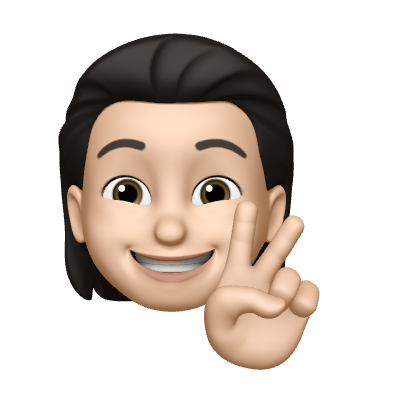

## 🗣️ CS 스터디

---

- 면접을 대비하기 위한 CS 스터디 입니다!
- 해당 CS 스터디의 개인 정리 레포지입니다.

 

## 📚 스터디 일시

---

- 매주 금요일 오후 5시 ~ 오후 7시
- 오프라인
- 스터디 인원: 3명
- 👉🏻 노션 링크: [CS 스터디](https://stormy-cardigan-61a.notion.site/CS-54efe9100fa74e0d9de9a6bc7e627959?pvs=4)

<table>
  <tr>
    <td align="center"><b>소재훈</b></td>
    <td align="center"><b>조화진</b></td>
    <td align="center"><b>문정환</b></td>
  </tr>
 <tr>
    <td align="center"></td>
    <td align="center"></td>
    <td align="center"></td>
  </tr>
</table>

 

## ⛳️ 스터디 진행 방식

---

- 매주 수요일까지 각자 주제의 질문 외 추가로 물어볼 공통 질문을 올립니다.
- 매주 금요일날 해당 주차에 대한 Topic과 함께 공통 질문들을 질문합니다.
- 면접관 2명, 피면접자 1명을 대상으로 돌아가면서 스터디를 진행한 후, Topic과 공통 질문 외에 추가로 나온 질문에 대해서 노션에 기록합니다.

 

## 📖 스터디 참고 자료

---

[테크 인터뷰](https://github.com/VSFe/Tech-Interview/tree/main)

[Technical Interview Guidelines for Beginner](https://github.com/JaeYeopHan/Interview_Question_for_Beginner)
